- [介绍](#介绍)
- [一、Root临时修改法](#一root临时修改法)
- [二、Lsp模块固定法](#二lsp模块固定法)
  - [1、下载模块](#1下载模块)
  - [2、修改为指定IP](#2修改为指定ip)
  - [3、实现原理](#3实现原理)
    - [①Android 9-10](#android-9-10)
    - [②Android 11](#android-11)
    - [③Android 12-13](#android-12-13)
    - [④Android 14-15](#android-14-15)
- [总结](#总结)
# 介绍
本文提供两种可以修改手机热点ip的方法：\
第一种只能每次开启热点后临时修改ip(关闭热点后失效)\
第二种可以固定修改ip
# 一、Root临时修改法
打开MT管理器、Termux或类似的终端\
输入`su`获取root权限，否则修改时会提示“Permission denied”\
输入指令查看无线接口信息，确认热点对应的网卡名字，通常是`wlan2`
```bash
iw dev
```
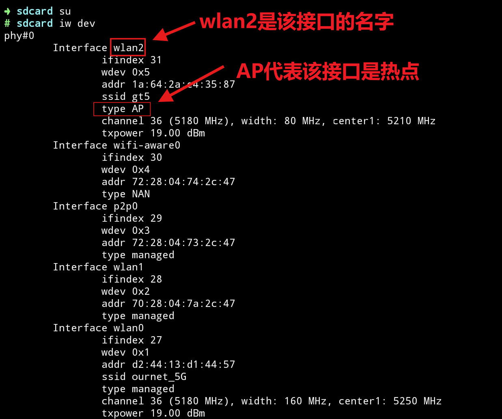
具体type含义可见下表：
| type | 含义 |
| ----- | ----- |
| managed | 普通WiFi客户端 |
| AP | 热点 |
| P2P | WiFi直连 |

输入指令修改热点ip（关掉热点后失效）
```bash
ifconfig [接口名字] [ip地址]
```
如：
```bash
ifconfig wlan2 192.168.137.152
```
可输入`ifconfig`确认是否修改成功
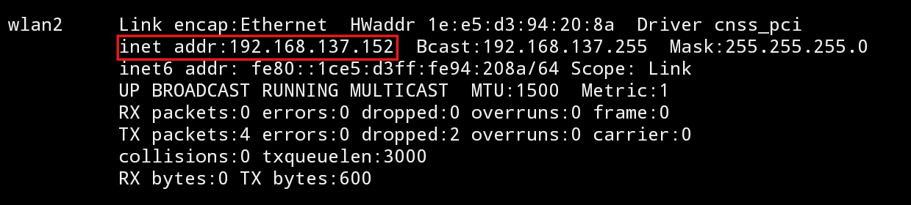

# 二、Lsp模块固定法
## 1、下载模块
::github{repo="XhyEax/SoftApHelper"}
打开release中的[最新版本](https://github.com/XhyEax/SoftApHelper/releases/latest)

下载`192.168.43.1`版本
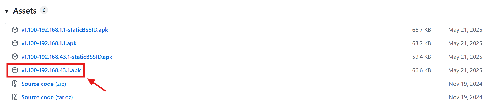
通过release中的表格，我们可以知道不同热点类型固定的ip是多少
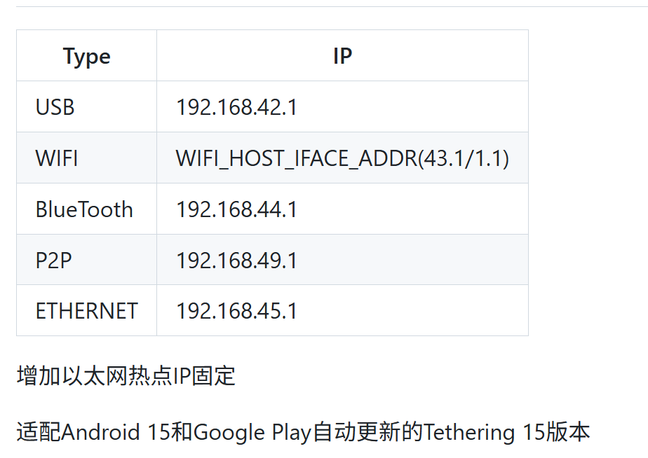
## 2、修改为指定IP
使用MT管理器找到apk文件
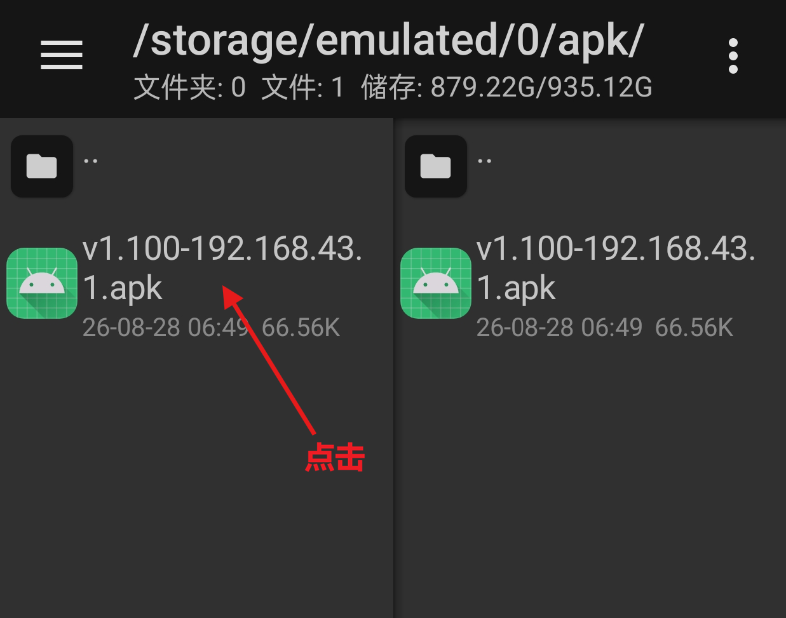
点击`查看`
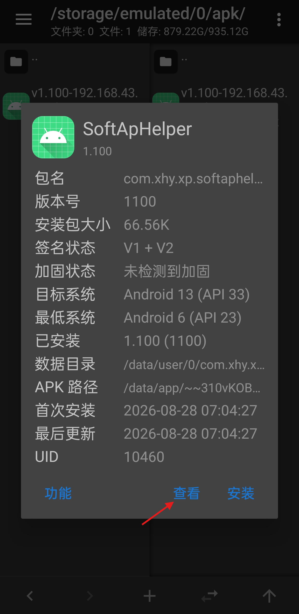
点击`dex文件`
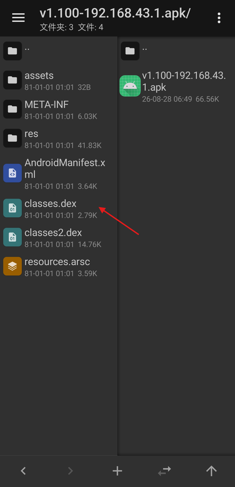
选择`dex编辑器++`
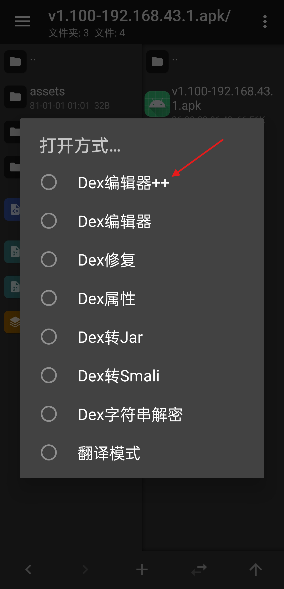
点击`全选`->`确定`
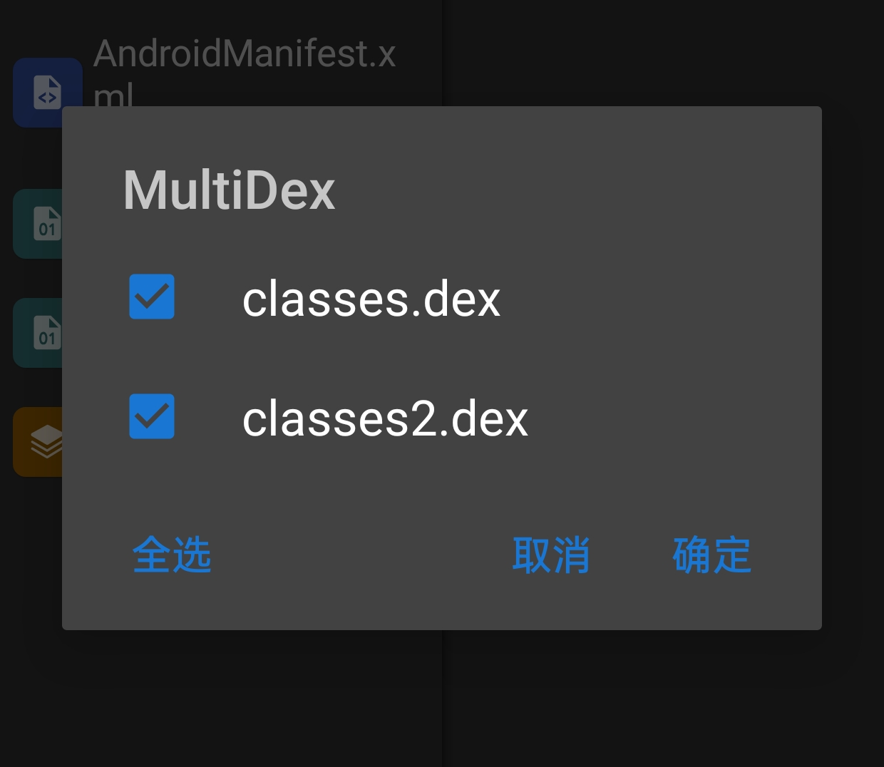
选择`常量`\
此处的ip对应release中不同类型热点固定的ip
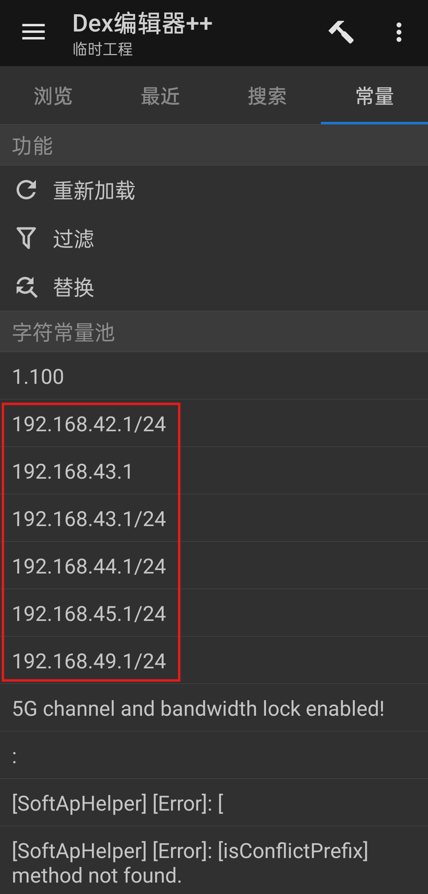
以修改WIFI热点为例\
点击字符常量池中的对应项，修改为你想要的ip\
修改完成后，点击`应用修改`
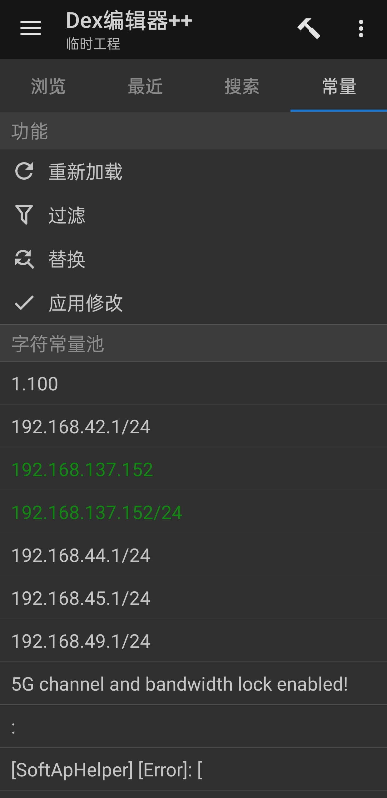
`返回`->`保存并退出`
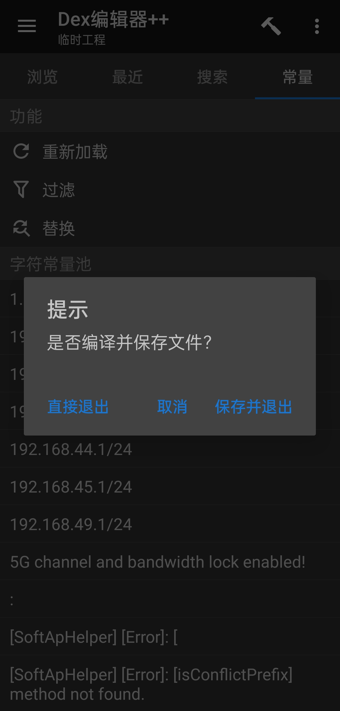
点击`确定`更新文件
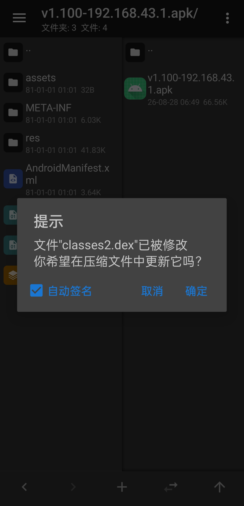
安装apk后在lsposed中启用即可\
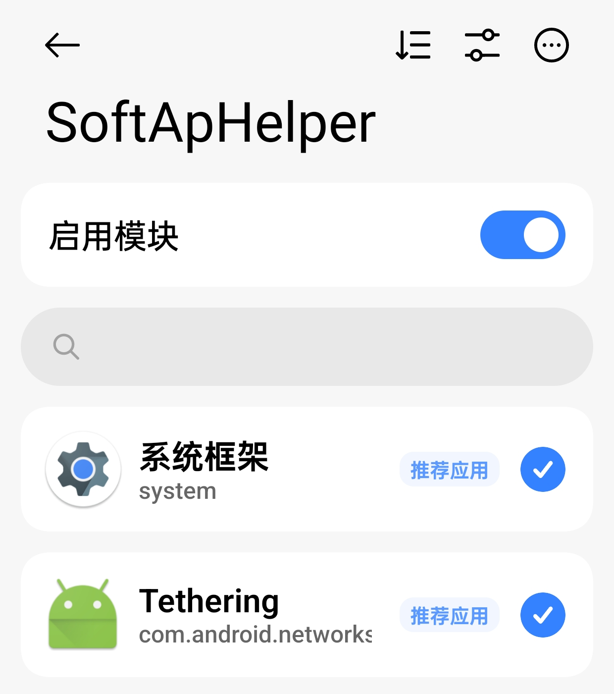
**注：Tethering可能勾选失败，输入正常现象，忽略即可**
## 3、实现原理
Android开启热点大致流程为：
```
	打开 Wi-Fi 热点
        ↓
	Tethering
        ↓
	创建热点接口wlan2
        ↓
	IpServer
        ↓
	为 wlan0 分配 IPv4 地址
        ↓
	启动 DHCP Server
        ↓
	IP：192.168.x.x
	网关：192.168.x.1
```
该模块在`为wlan0分配IPv4地址`这一步做Hook，把系统原本随机生成的地址替换成固定地址
### ①Android 9-10
安卓9和10的Hook点均为

```java
private String getRandomWifiIPv4Address()
```
虽然所在类有所不同\
安卓9：
```
com.android.server.connectivity.tethering.TetherInterfaceStateMachine
    └── getRandomWifiIPv4Address()
```
安卓10：
```
android.net.ip.IpServer
    └── getRandomWifiIPv4Address()

```
但大体思路相同
```
	SoftApHelper
        ↓
	Xposed Hook
        ↓
	拦截 getRandomWifiIPv4Address()
        ↓
	直接返回固定地址
```
### ②Android 11
安卓再次更改网络共享架构\
Hook点变为
```java
private LinkAddress requestIpv4Address()
```
由于该函数还被用于其他方式的网络共享及更换前缀，所以需要同时判断`网络类型`和`调用者`\
`网络类型`：
```java
mInterfaceType == TETHERING_WIFI
```
`调用者`：遍历堆栈查找`configureIPv4`


最后再进行替换\
Hook流程大致如下：
```
	requestIpv4Address()
        ↓
	是否mInterfaceType == TETHERING_WIFI
        ↓
        是
        ↓
	调用栈里面是否有configureIPv4？
        ↓
        是
        ↓
    替换地址
```
### ③Android 12-13
函数名没变，增加了参数`boolean useLastAddress`
```java
private LinkAddress requestIpv4Address(final boolean useLastAddress)
```
### ④Android 14-15
函数名没变，增加了参数`int scope`
```java
private LinkAddress requestIpv4Address(final int scope, final boolean useLastAddress)
```
# 总结
root法是临时修改，适合临时使用\
lsp模块法从源头进行修改，更加彻底且不会失效，适合长期使用

